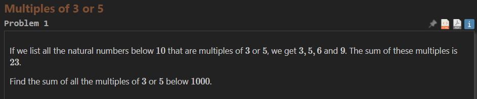

# Problem 1


```python
print("Hello, world!")
for i in range(10):
    print(i)  
```
First code to test the given case if my logic would work 

now i can scale the code and solve the problem 

```python
max = 1000
n= 0
sum = 0
while n < max:
    if n % 5 == 0 or n % 3 == 0:
        print(n)
        sum += n 
    n+=1 
print(sum)
```
Finalised code (not sure how efficient) but it works
beofre this I had made a mistake where i got the sum outside the "if" statement which would make it just find the sum of all the numbers which would have been incorrect